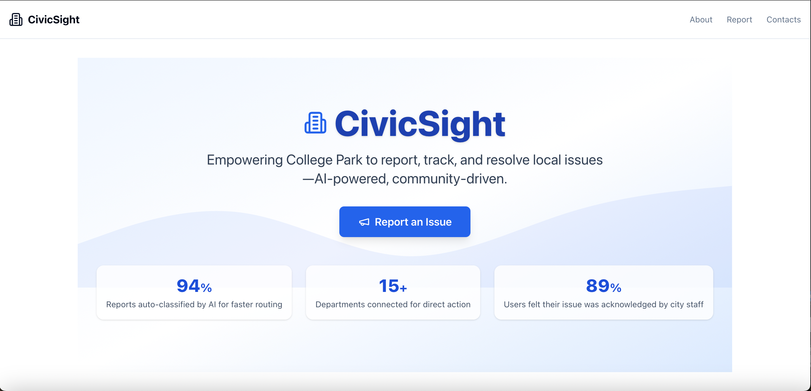

CivicSight: AI-Powered Community Issue Reporter & Analyzer
Empowering College Park residents to report, track, and resolve local non-emergency issues with AI and real-time city data.
Overview:
CivicSight is a modern civic-tech platform designed for College Park residents to easily report local non-emergency issues—like potholes, broken streetlights, or graffiti—and see real impact. Leveraging AI for smart classification and city data integrations, CivicSight streamlines issue resolution and builds community trust.
Key Features:
Modern, Responsive UI: Built with React, Vite, and TailwindCSS for a premium, mobile-friendly experience.
AI-Powered Reporting: HuggingFace AI auto-classifies and summarizes reports for faster city response.
Multi-Step Animated Form: User-friendly, validated, and includes Google Places autocomplete.
Live City Data: Integrates with Open311 and city APIs for real-time department routing and status updates.
Animated Stats & Dashboards: Visualize community impact and platform performance.
Accessibility & Dark Mode: Fully accessible and beautiful in any theme.
About Page: Emotionally resonant copy, city-themed imagery, and a strong call to action.
Screenshots:

!CivicSight Hero Section
!Animated Stats
Tech Stack
Frontend: React, Vite, TailwindCSS, Framer Motion, Lucide Icons
Backend: FastAPI (Python), HuggingFace Transformers, Open311/City Data APIs
Deployment: Vercel (Frontend), Natheer's Backend Hosting
Other: Google Places API, modern accessibility best practices
Project Structure:
Apply to package.json
file
Getting Started
Prerequisites
Node.js & npm (for frontend)
Python 3.11+ & pip (for backend)
1. Clone the repository
Apply to package.json
Analyzer
2. Frontend Setup
Apply to package.json
dev
Visit http://localhost:3000
3. Backend Setup
Apply to package.json
reload
API runs at http://localhost:8000
AI & Data Integrations:
HuggingFace Transformers: For report classification and summarization.
Open311/City APIs: For real-time department routing and status updates.
Google Places API: For address autocomplete in the report form.
Example Impact Stats:
94% Reports auto-classified by AI for faster routing
15+ Departments connected for direct action
89% Users felt their issue was acknowledged by city staff
Contributing:
Pull requests are welcome! For major changes, please open an issue first to discuss what you’d like to change.
License:
MIT (or your license of choice)
Contacts:
Created by Natheer Muwonge
LinkedIn: Natheer-Muwonge 